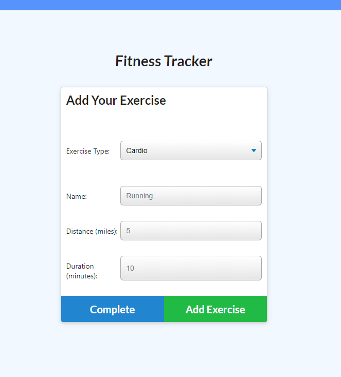
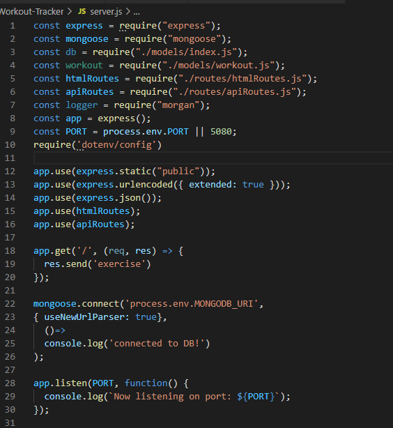

# Workout-Tracker

## About The Page ## 

An application that views, creates and tracks daily workouts. A user can log multiple exercises in a workout on a given day, and they can track the name, type, weight, sets, reps, and duration of exercise.

## WorkOut Screen Shot ##

Below are screenshots of my page and code for review:

### Screenshot of the WorkOut page ###

### Screenshot of the Server Code ###

## Built With ##

    Mongo and mongoose
    Express
    Node
    HTML 
    CSS 
    Bootstrap
    VS Code

### Installation ###

    Clone the repo

git clone https://github.com/Mitchelle-B/repo.git

## Contributing ##

    Fork the Project
    Create your Feature Branch (git checkout -b feature/AmazingFeature)
    Commit your Changes (git commit -m 'Add some AmazingFeature')
    Push to the Branch (git push origin feature/AmazingFeature)
    Open a Pull Request

## License ##

Distributed under the MIT License. See LICENSE for more information.
Contact

Project Link: https://github.com/Mitchelle-B/repo

## Acknowledgements ##

UWA Coding Bootcamp 